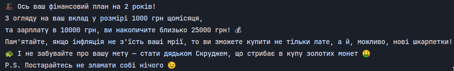

## Однорядковий лайнокод: Чим дивніше, тим краще 🤪
Цей репозиторій створено для участі у конкурсі до дня народження **[robot_dreams](https://robotdreams.cc/uk)** 🎉<br> 
Мета - написати однорядковий код, який розв'язує цікаву задачу у максимально незвичний спосіб. Немає ніяких правил або обмежень, **крім одного - чим дивніше рішення, тим воно цікавіше 🚀**
### Задача:
#### Розрахунок фінансового плану для багатства 🤑
Кожен з нас хоче забезпечити собі безтурботне майбутнє і купатися в купі грошей, як **Скрудж Макдак** 💸 <br>
Цей **«ідеальний»** код допоможе вам зрозуміти, скільки безцінних років життя вам доведеться витратити на видобуток такої корисної копалини, 
як **гроші** і нарешті купити таку ж **машину**, як у сусіда або стати власником новенького **iPhone** 😎

### Встановлення та запуск
1. Склонуйте репозиторій на свій комп'ютер:
    ```bash
   git clone https://github.com/AlexanderLukash/robot_dreams_shit_coder.git
   ```
2. Перейдіть у каталог проекту:
    ```bash
   cd robot_dreams_shit_coder
    ```
3. Переконайтеся, що у вас встановлено Python (версія 3.6 або вище). Ви можете перевірити це, запустивши:
    ```bash
   python --version
    ```
4. Запустіть програму за допомогою Python:
    ```bash
   python main.py
    ```
5. Дотримуйтесь інструкцій на екрані, відповідаючи на запитання. Не забудьте, що вводити потрібно числа, а не смачні пиріжки! 🍰

### Приклад використання
